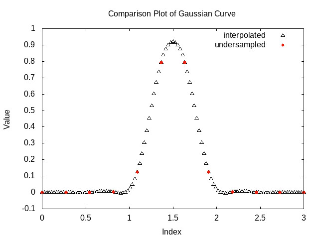

# QSpline

QSpline is a simple implementation of cubic spline interpolation in C.

## Setting Up

### Download the repository:
```
git clone https://github.com/gmguarino/QSpline.git
```

### Install `gnuplot`:

#### Linux

```
sudo apt update
sudo apt install gnuplot
```

#### Mac OS X
```
brew install gnuplot --with-x11
```

#### Windows
Download from their repo
```
https://sourceforge.net/projects/gnuplot/files/gnuplot/
```

## Running the Demo

To run the demo simply execute the shell script `execute.sh` (Linux).

The results are plotted and saved to `out.jpeg`:



## Running step-by-step

Compile the example program `interp.c`:
```
gcc -o interp interp.c QSpline.c -lm
```
Run the executable:
```
./interp
```
Plot the results using the `.plot` script in gnuplot:
```
gnuplot plotter.plot > out.jpeg
```
The results will be still stored in `out.jpeg`.

##### Remember!
Always clean up after yourself:
```
rm interp undersampled.dat interpolated.dat
```
